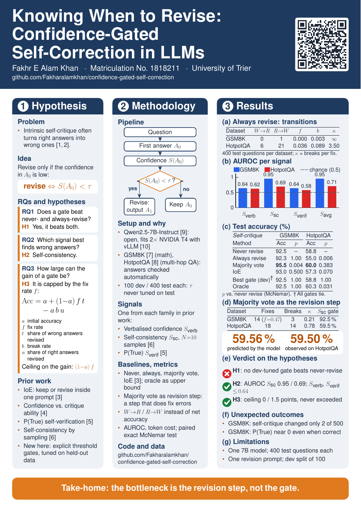

# Knowing When to Revise: Confidence-Gated Self-Correction in LLMs

Research poster for the NLP module, University of Trier.
Fakhr E Alam Khan, Matriculation No. 1818211.

## Idea
LLMs often break correct answers when they "self-correct". This project tests whether the model
should revise **only when it is unsure** about its first answer (confidence gating).

## How it works
1. The model (Qwen2.5-7B-Instruct) answers a question.
2. A confidence score is computed: verbalised confidence, self-consistency (10 samples) or P(True).
3. If the confidence is below a threshold, the answer is revised; otherwise it is kept.

## What I did
- Built the pipeline and ran it on GSM8K and HotpotQA (500 questions each) on Kaggle GPUs.
- Compared the three confidence signals against never / always revising, IoE and majority voting.
- Derived a simple formula that predicts when gating can help, and tested it on the results.

## Result
Self-critique almost never fixes a wrong answer, so gating cannot help. Self-consistency spots
wrong answers well (AUROC 0.95 on GSM8K), and its majority answer does fix errors.
**The bottleneck is the revision step, not the decision of when to revise.**

## Files
`poster.pdf` (poster) · `appendix.pdf` (references + declaration) · `experiments/` (code, data, results)
